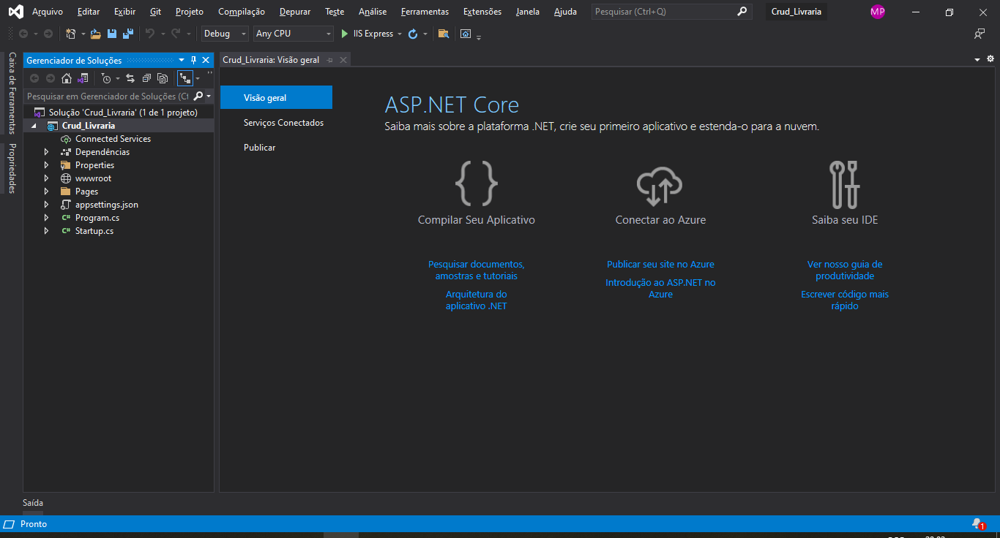

# Criando Um Projeto CRUD

---

## Criação:

Plataforma: Aplicativo Web [ASP.NET](http://asp.NET) Core

- Estrutura Após Criação



---

## Estrutura das Pastas:

- Crie uma Pasta Com o Nome **Models**
    - Dentro desta pasta é colocado as classes

        exemplo de um arquivo de classe:

        Usuario.cs

        ```csharp
        using System;
        using System.Collections.Generic;
        using System.Linq;
        using System.Threading.Tasks;

        namespace Crud_Usuario.Models
        {
            public class Usuario
            {
        				public int id { get; set; }
        				public string userName { get; set; }
            }
        }
        ```

        Componentes que Precisam Adicionar Ao Arquivo da **Model**:

        ```csharp
        using System.ComponentModel.DataAnnotations;
        using System.ComponentModel.DataAnnotations.Schema;
        ```

        Chaves Para Incluir os tipos de dados:

        ```csharp
        //ESSAS ANOTAÇÕES SÃO COLOCADAS ACIMA DE CADA ATRIBUTO QUE É NECESSITA
        [DataType(DataType.tipododado)] //anotação para tipos de dados diferentes
        [Key] //anotação para identificar a chave primária
        [Required(ErrorMessage = 'mensagem')] //indentifica os atributos como não nulos
        [Range 1, 10] //Determina o Lenght do Campo
        [Display (Name = 'Nome Que Irá aparecer na tela')]
        ```

        Será Criado uma Pasta para os componentes do CRUD, seguindo o exemplo acima, criaremos a pasta, **Usuarios,** dentro do diretório Pages.

        Próximo passo será adicionar um **Novo Item Com Scaffold** dentro desta pasta que acabou de ser criada,  do tipo **Página Razor usando Entity Framework(CRUD)**

        Após isso irá abrir uma página para selecionar algumas configurações:

        

        Caso ocorra este erro:

        

        - apenas tente novamente que irá funcionar

        ---

        # Banco De Dados

        Dentro do Visual Studio, vá até a aba ferramentas / Gerenciador de Pacotes do Nuget / Console do Gerenciador Pacotes, e digite estes comandos:

        ```powershell
        Add-Migration Inicial
        ```

        Esse Comando Migra o Modelo Para o Banco de Dados.  E gera um arquivo de conexão com o banco de dados.

        Após esse comando será necessário gerar o comando gerar o banco, com base no modelo criado, com isso utilize o comando:

        ```powershell
        Update-Database
        ```

        ---

        ## Após isso o CRUD já estará funcionando.